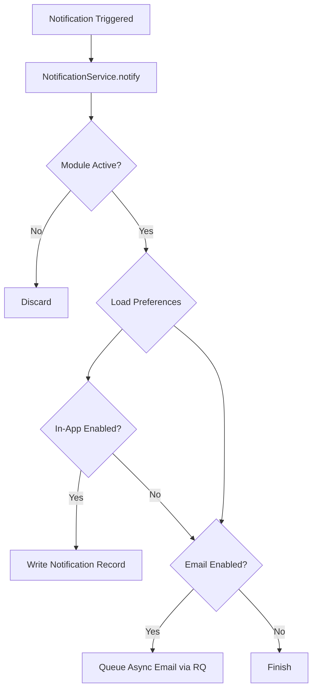

# QMS Platform — Notifications & Preferences Engine

This document provides a technical overview of the central Notification and Preference distribution engine in the QMS Platform.

---

## 1. System Overview

The QMS notification engine is a tenant-aware, preference-filtered, and asynchronous distribution system. It delivers **In-App** and **Email** notifications to users based on:
1. **Module Activation**: Checks if the target module/plugin is active for the user's enterprise.
2. **User Preferences**: Validates whether the recipient has enabled notifications (App or Email) for that category.
3. **Urgency/Priority**: High/critical alerts default to "enabled" if the user has not configured explicit preferences.



---

## 2. Data Models

Defined in [app/models/systeme.py](file:///home/jawad/qms_platform/app/models/systeme.py):

### `Notification`
Represents an individual in-app notification delivered to a user.
- `id` (Integer): Primary key.
- `type` (String): The specific notification category/type (e.g. `incident`, `overdue`, `action`).
- `message` (Text): The raw content of the notification.
- `categorie` (String): Logical group for module filtering (`hse`, `qualite`, `veille`, `systeme`, `general`, `technique`).
- `urgence` (String): Urgency level (`basse`, `normale`, `haute`, `critique`).
- `entite_type` (String): The referenced model class name (e.g. `'action'`, `'incident'`, `'document'`).
- `entite_id` (Integer): The ID of the referenced record.
- `lu` (Boolean): Read status of the notification.
- `date_envoi` (DateTime): Dispatch timestamp.

### `NotificationPreference`
Holds per-user, per-category notification channel permissions.
- `id` (Integer): Primary key.
- `utilisateur_id` (Integer): References the user.
- `categorie` (String): The category identifier.
- `app_enabled` (Boolean): Enable In-App delivery.
- `email_enabled` (Boolean): Enable Email delivery.
- `frequence` (String): Delivery frequency (`immediat`, `quotidien`, `hebdo`).

*Constraints*: Unique constraint on `(utilisateur_id, categorie)`.

---

## 3. How to Trigger Notifications

### A. The Modern Way: `NotificationService.notify()`
To notify a specific user, call the central service helper inside [app/services/notification_service.py](file:///home/jawad/qms_platform/app/services/notification_service.py):

```python
from app.services.notification_service import NotificationService

NotificationService.notify(
    utilisateur_id=user.id,
    category='hse',
    message="Un nouvel incident a été déclaré.",
    urgence='haute',
    entite_type='incident',
    entite_id=incident.id
)
```

### B. Legacy Compatibility: `create_notification()`
A legacy wrapper is available in [app/utils/notifications.py](file:///home/jawad/qms_platform/app/utils/notifications.py) to map older call styles (from HSE routes, alerts, etc.) and delegate them to `NotificationService.notify()`.

```python
from app.utils.notifications import create_notification

create_notification(
    user_id=user.id,
    message="Action corrective en retard",
    type='overdue',
    entite_id=action.id,
    entite_type='action'
)
```

---

## 4. Click-to-Detail Routing

When a user clicks on an in-app notification, the frontend hits `/notifications/<int:id>/open` which executes `notification_open()` in [app/main/routes.py](file:///home/jawad/qms_platform/app/main/routes.py).

### Resolution Priority:
1. **Direct Routing (`entite_type` + `entite_id`)**:
   It resolves the target route through the `ENTITY_ROUTE_MAP`:
   ```python
   ENTITY_ROUTE_MAP = {
       'ticket':          ('support.detail_ticket',        'ticket_id'),
       'incident':        ('hse.incidents',                None),
       'accident':        ('hse.incidents',                None),
       'presqu_accident': ('hse.incidents',                None),
       'action':          ('actions.detail_action',         'action_id'),
       'document':        ('documents.detail',              'proof_id'),
       'nonconformite':   ('nonconformites.index',          None),
   }
   ```
2. **Fallback Regex Parsing**:
   If no `entite_type` is present, it scans the message string for:
   - `[TICKET:N]` -> Redirects to ticket detail.
   - `[INCIDENT:N]` -> Redirects to HSE incidents dashboard.
3. **Keyword Matching**:
   If the message contains `'Bug applicatif'`, it redirects to the system security log page.
4. **Fallback**:
   Redirects to the default dashboard (`main.index`).

---

## 5. Worker & Asynchronous Tasks

Emails are dispatched asynchronously to prevent request threads from blocking.
- When an email notification is generated, `NotificationService._enqueue_email()` pushes the task into **Redis Queue (RQ)**.
- The background worker executes `send_email_notification_task` to format and send the SMTP mail.

**Redis Queues configuration:**
- `default` queue is used for standard notification emails.
- `high` queue is used for urgent alerts (e.g. critical server monitoring or incidents).

---

## 6. Developer Guidelines (Best Practices)

### ⚠️ Transaction Safety
- `NotificationService.notify()` uses **`db.session.flush()`** instead of `db.session.commit()`.
- Flushed notifications are saved to the current transaction (obtaining an ID) but are **not committed yet**.
- **Rule**: If you trigger notifications in a route/service, you must call `db.session.commit()` at the end of your workflow to persist both the business entity and the notification. If your transaction rolls back, the notification is safely discarded.

### 📌 Creating new notification categories
1. Add the category identifier to `TYPE_CATEGORY_MAP`, `TYPE_URGENCE_MAP`, and `TYPE_ENTITE_TYPE_MAP` in [app/utils/notifications.py](file:///home/jawad/qms_platform/app/utils/notifications.py).
2. If it requires custom layout styling on the user preferences page, specify `'row_class'` and `'bg_class'` in Python rather than hardcoding it in the template.
